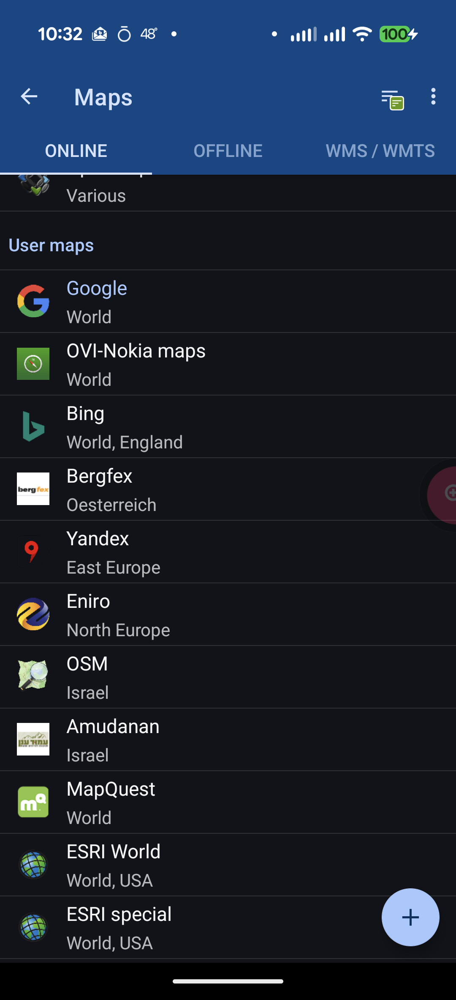

# LocusMapTweak

These files extend online map providers in **Locus Map Classic** and **Locus Map 4**.
The `providers.xml` works for both versions - only the installation location differs. The icons are optional but add visual clarity in the map manager.

---

## What's Included

This collection includes **150+ online map providers** covering multiple regions and use cases:

### Major Providers
- **Google** (Classic, Satellite, Hybrid, Terrain, Bike, Transit)
- **Bing** (Road, Satellite, Hybrid, OS Maps)
- **Apple** Maps
- **Here** (Classic, Hybrid, Terrain)
- **MapBox** & **MapQuest**
- **TomTom** (Classic + Traffic Overlay)
- **Yandex** (East Europe coverage)

### Regional & Specialized Maps
- **Europe:** Bergfex (Austria), Kompass.de (Hiking), Falk, Eniro (Scandinavia)
- **France:** Geoportail (Maps, Satellite, Coastal, Cadastre)
- **Norway:** Statkart (Topographic)
- **Israel:** Amudanan, OSM Israel Hiking
- **Germany:** ICAO Airspace, OSM German Style

### Outdoor & Recreation
- **Waymarked Trails** (Hiking, Cycling, MTB, Skating, Horse Riding, Winter Sports)
- **OpenRailwayMap** (Infrastructure, Maxspeeds, Signalling)
- **Outdoor Active** (Hiking maps)

### Overlays & Extras
- **Weather** (Clouds, Weather Icons)
- **Traffic** (Google, TomTom)
- **Mapillary** Traces
- **ESRI World** (Street, Satellite, Topo, Terrain, Ocean, NatGeo)
- **ESRI USA Demographics** (20+ demographic layers)

Many providers include multiple map styles and zoom levels optimized for different use cases (road navigation, hiking, cycling, aerial photography, etc.).

---

## Compatibility

- ✅ **Locus Map Classic** - Fully supported
- ✅ **Locus Map 4** - Fully supported (same XML format, different installation path)

---

## Installation

### Locus Map 4

**⚠️ Important:** Before installing, go to Locus Map 4 **Settings → Data & Backup → Storage** and switch the storage location to **"Android/media"** (instead of "Android/data"). This makes the files accessible via standard file managers and avoids Android scoped storage restrictions.

#### Installation Steps:

1. On your Android device, navigate to:
   ```
   Internal Storage/Android/media/menion.android.locus/mapsOnline/custom/
   ```
   (Create the `custom` folder if it doesn't exist)

2. Copy these files from this repository:
   - `providers.xml` (the main configuration file)
   - All `.png` icon files from the `icons/` folder

3. Restart Locus Map 4

**Note:** Icon names must match the `<name>` tags in the XML (e.g., `google.png` for `<name>Google</name>`). The matching is case-insensitive.

#### Verify Installation

After installation and restart, verify the custom maps are working:

1. Open **Locus Map 4**
2. Tap the **Map** button (bottom left)
3. Select **Online Maps** tab
4. You should see all the custom map providers organized by name (Google, Bing, Apple, etc.)



*Screenshot showing custom map providers successfully loaded in Locus Map 4*

#### Alternative: Using Android/data Storage

If you prefer to keep the default "Android/data" location, copy files to:
```
Internal Storage/Android/data/menion.android.locus/files/Locus/mapsOnline/custom/
```

However, accessing this location requires:
- Connecting your phone to a computer via USB, OR
- Using a specialized file manager (Solid Explorer, FX File Explorer, Material Files, or Total Commander)

### Locus Map Classic

Copy the file `providers.xml` and all icons into this directory:

```
Internal Storage/Locus/mapsOnline/custom/
```

Or on some devices:
```
SD Card/Locus/mapsOnline/custom/
```

### Legacy: Locus Map Tweak App

The Locus Map Tweak app is no longer on the Google Play store, but you can still download and side-load the APK from other sources, like: <http://locus-addon-map-tweak.apk.watch/3.2.2>

*However,* that app hasn't been updated with changes found in this repository, and manual installation as described above is **much safer and more current.**

---

## Troubleshooting

### Maps don't appear in Locus Map 4

1. **Check storage setting:** Verify you've switched to "Android/media" storage in Settings → Data & Backup → Storage
2. **Verify file location:** Ensure files are in the `custom/` subfolder, not just `mapsOnline/`
3. **Restart the app:** Force close and restart Locus Map after copying files
4. **Check permissions:** Make sure Locus Map has storage permissions enabled in Android Settings

### Maps appear but don't load tiles

1. **Check internet connection:** Most maps require an active internet connection
2. **Outdated URLs:** Some map providers may have changed their tile servers - check for updates to this repository
3. **Rate limiting:** Some providers may block requests - try a different map provider

### Can't find or access the installation folder

- **For Android/media:** Use Google Files or any standard file manager
- **For Android/data:** This folder is hidden in most file managers on Android 11+. Either:
  - Connect to a computer via USB
  - Use a specialized file manager that can access restricted folders
  - Switch to "Android/media" in Locus settings (recommended)

### Icons don't appear

1. Verify icon files are in the same `custom/` folder as `providers.xml`
2. Check that icon filenames match provider names (e.g., `Google` → `google.png`)
3. Icons are optional - maps will still work without them

---

## Other Notes

### Official Documentation

For detailed information about the custom online maps format and how to create or modify map providers:

- **Locus Map 4:** [Custom Online Maps Documentation](https://docs.locusmap.app/doku.php?id=manual:advanced:customization:online_maps)
- **Locus Map Classic:** [Custom Online Maps Documentation](https://docs.locusmap.eu/doku.php?id=manual:advanced:customization:online_maps)

The XML format is identical between both versions.

### Add your contributions

If you want to contribute to `providers.xml`, you can find or fix maps following the documentation linked above. 

Feel free to submit PRs or send me changes you make and I will update this repository.

### Forked with updates from

The original author of this collection appears to have abandoned it.  I have taken the PRs made against [that repo](https://github.com/mjk912/LocusMapTweak) and merged them here.
